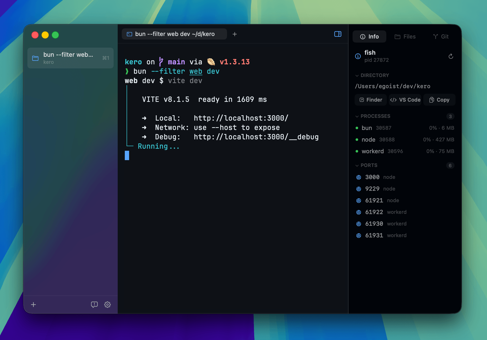

<p align="center">
  
</p>

# Yeet

A native terminal workspace for macOS. Based on [Kero](https://github.com/egoist/kero) by [EGOIST](https://github.com/egoist). GPLv3.



## Install

Build from source — [CONTRIBUTING.md](CONTRIBUTING.md). You need Xcode 26.5 or later and a Rust toolchain.

When a GitHub Release includes `Yeet.zip`, you can also install the cask or the zip:

```bash
brew tap ttaatoo/yeet https://github.com/ttaatoo/yeet
brew install --cask ttaatoo/yeet/yeet
```

Upgrade:

```bash
git -C "$(brew --repo ttaatoo/yeet)" pull && brew upgrade --cask ttaatoo/yeet/yeet
```

Or download `Yeet.zip` from [Releases](https://github.com/ttaatoo/yeet/releases) when that asset is attached.

Builds are **ad-hoc signed** (no Apple Developer ID). The cask does not strip Gatekeeper quarantine. If macOS blocks the app: **System Settings → Privacy & Security → Open Anyway**.

This is not official [Kero](https://kero.sh). `brew install egoist/tap/kero` installs `Kero.app`. Yeet is `Yeet.app` / `sh.yeet`, with settings in `~/.config/yeet`. Packaged builds have no in-app updater — use Homebrew, a new zip, or rebuild from source.

## Features

- Native AppKit interface for projects, tabs, and split panes
- GPU-accelerated Alacritty terminal backend
- Integrated browser tabs and panes
- File tree, Git status, and editable diffs
- Command palette, project-wide file search, and local path links
- AI agents can delegate background work and coordinate across Yeet panes, with provider-reported status and human-controlled approvals

## Differences from Kero

| | Official Kero | Yeet |
| --- | --- | --- |
| App | `Kero.app` | `Yeet.app` |
| Bundle id | `sh.kero` | `sh.yeet` |
| Config | `~/.config/kero` | `~/.config/yeet` |
| CLI | `kero` | `yeet` |
| Signing | Developer ID | ad-hoc |
| Updates | Sparkle (`releases.kero.sh`) | Homebrew, zip, or rebuild (no Sparkle) |

If `~/.config/yeet` is missing, Yeet copies leftover `~/.config/kerox`, otherwise older `~/.config/kero`.

## Contributing

Open an [issue](https://github.com/ttaatoo/yeet/issues) first for anything
larger than a fix. See [CONTRIBUTING.md](CONTRIBUTING.md) and the
[code of conduct](CODE_OF_CONDUCT.md). Security reports:
[SECURITY.md](SECURITY.md).

## License

GPL-3.0-only. See [LICENSE](LICENSE) and [NOTICE](NOTICE).
